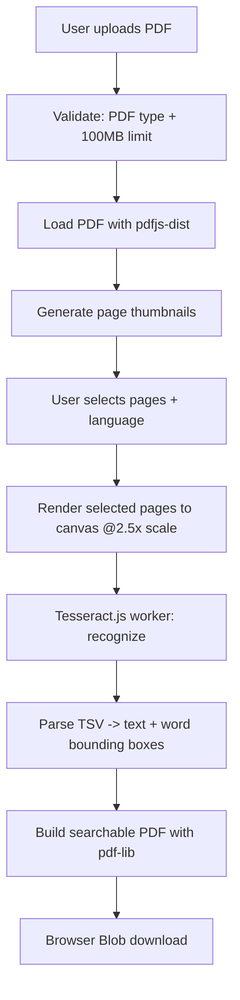
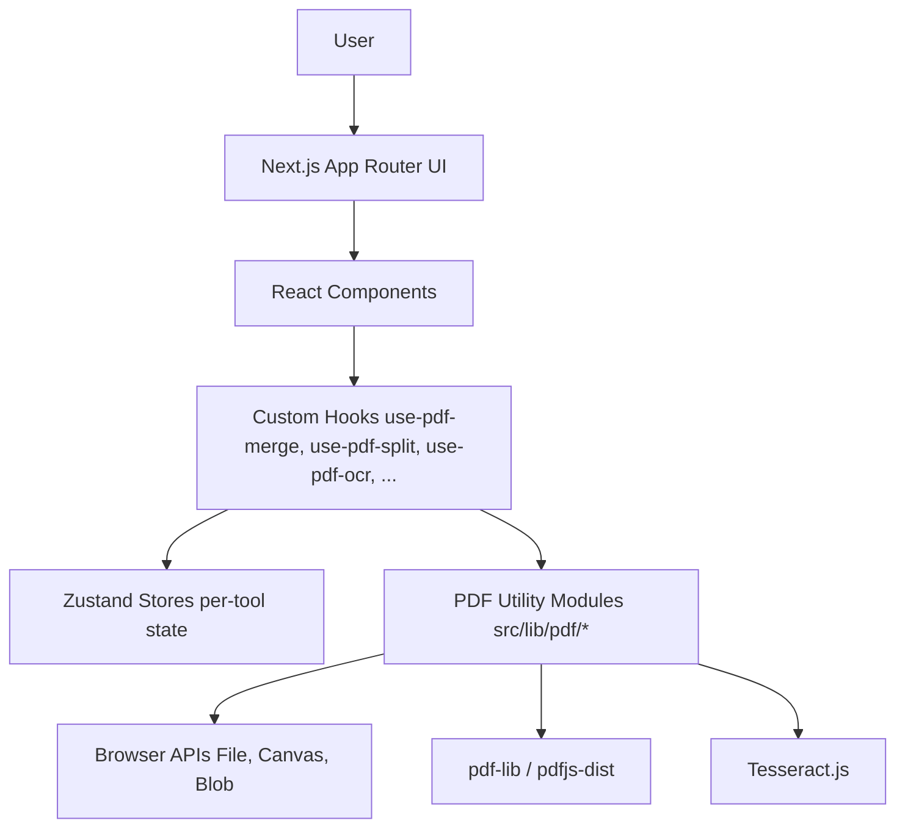

<div align="center">

# Privacy-First PDF Processor

**PDF processing that runs entirely in your browser — nothing is uploaded to a server.**

[](https://nextjs.org/)
[](https://react.dev/)
[](https://www.typescriptlang.org/)
[](https://tailwindcss.com/)
[](https://github.com/pmndrs/zustand)
[](#license)

</div>

---

## Overview

Privacy-First PDF Processor is a **client-side PDF toolkit** built with Next.js and React. Every PDF operation — merging, splitting, compressing, rotating, extracting pages, watermarking, and OCR — runs inside the user's browser using `pdf-lib`, `pdfjs-dist`, and `Tesseract.js`. Files are read with the browser's File API and processed in memory; the application has no backend API routes and never sends a document over the network.

This is useful for anyone who wants to perform routine PDF edits — merging reports, splitting scanned batches, watermarking drafts, extracting a few pages, or making a scanned document searchable — without uploading potentially sensitive documents to a third-party server. It's a portfolio/personal project built around that constraint, not a hosted SaaS product.

---

## Core Features

| Feature | Description | Processing |
|---|---|---|
| **Dashboard** | Central hub with tool cards, recent activity, and upload shortcuts | Client-side (UI only) |
| **Merge PDF** | Combine multiple PDFs into one document, preserving page order | Client-side (`pdf-lib`) |
| **Split PDF** | Extract selected pages into a new PDF using a visual page picker | Client-side (`pdf-lib` + `pdfjs-dist` thumbnails) |
| **Compress PDF** | Rebuilds the PDF object structure and strips metadata (low/medium/high) to reduce size | Client-side (`pdf-lib`) |
| **Rotate PDF** | Rotate individual or all pages by 0°/90°/180°/270° | Client-side (`pdf-lib`) |
| **Extract Pages** | Copy a chosen set of pages into a brand-new PDF | Client-side (`pdf-lib`) |
| **Watermark PDF** | Apply a positioned, styled text watermark across all pages | Client-side (`pdf-lib`) |
| **OCR** | Recognize text in scanned pages and produce a searchable PDF | Client-side (`pdfjs-dist` render → `Tesseract.js` recognize → `pdf-lib` rebuild) |

> **Note on "Compress":** this is a real, working feature, but it works by rebuilding the PDF's internal object structure and clearing metadata (producer/creator, and optionally title/author/subject/keywords depending on the chosen level) — not by re-encoding or downsampling embedded images. Size reduction will vary a lot by source file and can be minimal on already-optimized PDFs.

A **Settings** page is referenced in project planning but does not currently exist as a route in the codebase.

---

## OCR Architecture

OCR is the most involved feature in the app. The actual flow, traced from `src/hooks/use-pdf-ocr.ts`:

1. **Upload & validate** — the selected file is checked against a PDF MIME-type and 100MB size limit (`src/lib/pdf/ocr/validation.ts`).
2. **Load the document** — `pdfjs-dist` parses the file into a `PDFDocumentProxy` (`pdf-loader.ts`). `pdfjs-dist`'s own worker script is registered in `src/lib/worker/pdf-worker.ts` so parsing/rendering happen off the main thread via PDF.js's built-in worker.
3. **Generate page thumbnails** — each page is rendered at thumbnail scale for the page picker UI (`thumbnail.ts`).
4. **Page selection** — the user selects which pages to OCR via the page grid; state is tracked in a Zustand store (`src/store/ocr.ts`).
5. **Render selected pages to canvas** — each selected page is rendered at 2.5x scale onto an `HTMLCanvasElement` for higher OCR accuracy (`image-renderer.ts`).
6. **Run OCR** — `Tesseract.js` is dynamically imported and a worker is created per run (`createWorker(language)`), recognizing each canvas image and returning text, confidence, and a TSV word-position table that's parsed into word-level bounding boxes (`ocr-engine.ts`).
7. **Build a searchable PDF** — the recognized text and word coordinates are layered onto the page images and reassembled into a new PDF with `pdf-lib` (`searchable-pdf.ts`).
8. **Download** — the resulting PDF is handed to the browser as a Blob download; no upload step exists (`download.ts`).

OCR currently supports **English, Hindi, and English+Hindi** (`src/components/OCR/ocr-language-selector.tsx`). Progress (current page, percentage, step label) is streamed back into the Zustand store so the UI can show live status during recognition.

---

## Project Flow — OCR



## High-Level Application Architecture



There is no backend service and no API route in the codebase (`src/app` contains only pages and layouts, no `route.ts` files) — every arrow above stays inside the browser.

---

## Architecture

- **Next.js App Router**, with a `(app)` route group wrapping every tool page in a shared dashboard shell (`src/app/(app)/layout.tsx`) that renders a persistent `Sidebar` and `Header`.
- **Routes**: `/` (landing page), `/dashboard`, `/merge`, `/split`, `/compress`, `/rotate`, `/extract`, `/watermark`, `/ocr`.
- **Client components**: all interactive tool pages are client components (`"use client"`), since PDF processing depends on browser-only APIs (File, Canvas, Blob).
- **Custom hooks** (`src/hooks/use-pdf-*.ts`) sit between UI components and the processing engines — one hook per tool, each orchestrating validation → engine call → store update.
- **Zustand stores** (`src/store/*.ts`) hold per-tool state (loaded document, page selection, progress, results) — one store per feature, no shared global store.
- **PDF utility modules** (`src/lib/pdf/<feature>/`) contain the actual processing logic (engine, validation, thumbnailing, download) per feature, kept separate from React so the logic is framework-agnostic and testable in isolation.
- **Reusable UI** (`src/components/ui/`) — hand-built primitives (button, card, dropdown-menu, tooltip, page grid, toolbar, etc.) styled with Tailwind, several following shadcn/ui conventions, built on Radix UI primitives for accessibility.
- **Worker usage**: `pdfjs-dist` runs its own parsing/rendering worker (configured in `src/lib/worker/pdf-worker.ts`). `Tesseract.js` manages its own worker internally via `createWorker`. The `comlink` package is listed as a dependency but is not currently referenced anywhere in `src/` — there is no custom-built worker communication layer at this time.

---

## Technology Stack

| Category | Technology | Purpose |
|---|---|---|
| Framework | Next.js 16 (App Router) | Routing, rendering, build tooling |
| Language | TypeScript 5 | Type safety across the codebase |
| UI Library | React 19 | Component model |
| Styling | Tailwind CSS 4 | Utility-first styling |
| Component Primitives | Radix UI (`react-avatar`, `react-dialog`, `react-dropdown-menu`, `react-slot`, `react-tooltip`) | Accessible headless UI primitives |
| Component Conventions | shadcn/ui, `components.json` | Copy-in component patterns on top of Radix + Tailwind |
| Animation | Framer Motion | Page/element transitions and micro-interactions |
| Icons | Lucide React, React Icons | Iconography |
| Class Utilities | `class-variance-authority`, `clsx`, `tailwind-merge`, `tw-animate-css` | Variant-driven styling and class merging |
| PDF Processing | pdf-lib | Creating, merging, rotating, watermarking, and rebuilding PDFs |
| PDF Rendering/Parsing | pdfjs-dist | Loading PDFs and rendering pages to canvas/thumbnails |
| OCR | Tesseract.js 7 | In-browser optical character recognition |
| State Management | Zustand | Per-feature client state |
| Deployment | Vercel | Hosting (Next.js project) |
| Version Control | Git / GitHub | Source control |

---

## Libraries & What They Do

| Library | Purpose |
|---|---|
| `next` | Application framework (App Router, build/dev server) |
| `react` / `react-dom` | UI rendering |
| `typescript` | Static typing |
| `pdf-lib` | PDF creation/manipulation (merge, split, rotate, watermark, extract, compress) |
| `pdfjs-dist` | PDF parsing and page rendering (thumbnails, OCR page images) |
| `tesseract.js` | In-browser OCR engine |
| `zustand` | Lightweight client state management |
| `framer-motion` | Animations |
| `lucide-react`, `react-icons` | Icon sets |
| `tailwindcss` | Utility-first CSS |
| `@radix-ui/*`, `radix-ui` | Accessible UI primitives (dialog, dropdown, tooltip, avatar, slot) |
| `shadcn` | UI component tooling/conventions |
| `class-variance-authority`, `clsx`, `tailwind-merge` | Class name composition for variant-based components |
| `comlink` | Installed but not currently used in the codebase |

---

## Privacy Model

- **No document upload**: every processing engine (`src/lib/pdf/**/*-engine.ts`) reads the file via the browser's `File.arrayBuffer()` API and writes output as an in-memory `Uint8Array`. There is no `fetch`/`axios` call to any backend, and no API route exists under `src/app`.
- **All eight tools process client-side**: merge, split, compress, rotate, extract, and watermark run through `pdf-lib` entirely in the browser tab. OCR runs `pdfjs-dist` (rendering) and `Tesseract.js` (recognition) entirely in the browser as well — no page image or recognized text is sent anywhere.
- **Output stays local**: results are handed to the browser as downloadable Blobs; the app does not persist files to any storage service.
- **What could leave the browser**: standard web page loads (fonts via `next/font`, the app's own JS bundle) behave like any other website. No document content is included in those requests.

This is a genuine architectural property of the current implementation, not a policy promise layered on top of a server — there is simply no server-side document-handling code to send data to.

---

## Security / Privacy Considerations

- Client-side processing means a document briefly exists in browser memory (and, for OCR, as rendered canvas images) for the duration of the operation — this is not persistent storage and is cleared when the tab/page is closed or reset.
- "Nothing is uploaded" reduces exposure to server breaches and third-party storage, but it does not protect against a compromised or malicious browser environment (e.g. malicious extensions with page access).
- Client-side processing is not a substitute for encryption at rest — if you save the output file to disk, that file is only as protected as your own filesystem/device.
- Very large PDFs are bounded by the 100MB upload limit enforced in `file-validation.ts`, and further bounded by available browser memory/tab performance beyond that.
- There is currently no dependency-vulnerability or security audit documented in this repository.

---

## Performance

- All processing (PDF parsing, rendering, OCR, and rebuilding) happens on the client, so performance depends on the user's device and browser, not a server.
- `pdfjs-dist` renders pages via its own worker script, keeping PDF parsing/rendering off the main UI thread.
- OCR is the most CPU-intensive operation: `Tesseract.js` recognizes one page at a time sequentially (see the loop in `ocr-engine.ts`), and pages are rendered at 2.5x scale before recognition to improve accuracy — larger scale and more pages both increase processing time.
- No explicit Web Worker is used for the `pdf-lib` operations (merge/split/compress/rotate/extract/watermark) — these run synchronously relative to the calling hook, so very large or many-page PDFs can briefly block the UI thread during processing.
- No formal benchmark numbers are published in this repository; actual timings will vary significantly by device, PDF size, and page count.

---

## Project Structure

```text
privacy-first-pdf-processor/
├── README.md
└── web/                          # Next.js application
    ├── package.json
    ├── next.config.ts
    ├── tsconfig.json
    ├── components.json           # shadcn/ui config
    ├── public/
    └── src/
        ├── app/
        │   ├── page.tsx           # Landing page ("/")
        │   ├── layout.tsx         # Root layout (fonts, theme init)
        │   ├── globals.css
        │   └── (app)/             # Route group: dashboard shell + tools
        │       ├── layout.tsx     # Sidebar + Header shell
        │       ├── dashboard/page.tsx
        │       ├── merge/page.tsx
        │       ├── split/page.tsx
        │       ├── compress/page.tsx
        │       ├── rotate/page.tsx
        │       ├── extract/page.tsx
        │       ├── watermark/page.tsx
        │       └── ocr/page.tsx
        ├── components/
        │   ├── Dashboard/         # Dashboard hero, stats, tool grid, upload card
        │   ├── landing/           # Marketing landing page sections
        │   ├── layout/            # Sidebar, header
        │   ├── OCR/                # OCR upload, page grid, language selector, progress
        │   ├── pdf-merge/ pdf-split/ pdf-compress/ pdf-rotate/ pdf-extract/ watermark/
        │   ├── upload/             # Shared upload zone/progress/file-card
        │   └── ui/                 # Hand-built primitives (button, card, tooltip, ...)
        ├── hooks/                  # use-pdf-merge, use-pdf-split, use-pdf-ocr, ...
        ├── lib/
        │   ├── pdf/
        │   │   ├── merge/ split/ compress/ rotate/ extract/ watermark/
        │   │   └── ocr/            # validation, pdf-loader, thumbnail, image-renderer,
        │   │                       # ocr-engine, searchable-pdf, download
        │   ├── worker/pdf-worker.ts
        │   ├── file-validation.ts
        │   └── cn.ts
        ├── store/                  # One Zustand store per feature
        └── types/
```

---

## OCR Internal Flow

```text
src/hooks/use-pdf-ocr.ts
    ↓
src/lib/pdf/ocr/validation.ts       (PDF type + size check)
    ↓
src/lib/pdf/ocr/pdf-loader.ts       (pdfjs-dist document load)
    ↓
src/lib/pdf/ocr/thumbnail.ts        (page thumbnails for UI)
    ↓
src/lib/pdf/ocr/image-renderer.ts   (render selected pages to canvas @2.5x)
    ↓
src/lib/pdf/ocr/ocr-engine.ts       (Tesseract.js recognize + TSV parsing)
    ↓
src/lib/pdf/ocr/searchable-pdf.ts   (rebuild as searchable PDF via pdf-lib)
    ↓
src/lib/pdf/ocr/download.ts         (Blob download)
```

State throughout this flow is held in `src/store/ocr.ts` (Zustand), which the hook reads from and writes to at each step.

---

## Local Development

```bash
git clone https://github.com/sandipkumarjha/privacy-first-pdf-processor.git
cd privacy-first-pdf-processor/web
npm install
npm run dev
```

Then open:


https://privacy-first-pdf-processor.vercel.app

---

## Production Build

```bash
npm run build
npm run start
```

Run `npm run build` before deploying — it type-checks the project and generates the optimized production output.

---

## Deployment

The app is a standard Next.js project and is set up to deploy on **Vercel**:

- Connect the GitHub repository to Vercel.
- Vercel auto-detects the Next.js framework.
- Set the project's **Root Directory** to `web` (the Next.js app lives inside `web/`, not the repo root).
- Vercel runs `npm run build` for production deploys.

No live deployment URL is confirmed in this repository at this time.

---

## Environment Variables

No environment variables are currently required. No `.env` files or `process.env` usage were found in the codebase.

---

## Design / UX

- **Dashboard shell**: persistent sidebar + header layout wrapping all tool pages (`(app)/layout.tsx`), with a max-width content container and subtle background accents.
- **Dark/light theme**: theme is initialized before hydration via an inline script (`src/lib/theme-script.ts`) and toggled client-side (`src/components/theme-toggle.tsx`), persisted to `localStorage`.
- **Component system**: buttons, cards, dropdowns, tooltips, and avatars are built on Radix UI primitives for accessible keyboard/focus/ARIA behavior, styled with Tailwind and `class-variance-authority` for variants.
- **Animations**: Framer Motion is used for UI transitions across landing and dashboard sections.
- **Landing page**: separate marketing sections (hero, features, how-it-works, privacy explanation, FAQ, footer) under `src/components/landing/`, including a custom "air-gap" diagram component illustrating the no-upload architecture.
- **Per-tool UX pattern**: each tool follows the same shape — an upload area, a page grid/thumbnail view for selection, a toolbar for options, and a download/result step — implemented consistently across merge, split, rotate, extract, watermark, and OCR.

---

## Limitations

- OCR accuracy depends heavily on scan quality, font, and language — results for noisy or skewed scans will be worse than for clean, high-resolution pages.
- OCR is CPU-intensive and processes pages sequentially, so multi-page OCR jobs can take noticeably longer on lower-powered devices.
- Large PDFs (up to the 100MB limit) can consume significant browser memory during processing, especially for OCR's canvas rendering step.
- "Compress" reduces file size via metadata stripping and object-stream rebuilding, not image re-encoding — gains vary by source file and can be small for already-optimized PDFs.
- `pdf-lib` operations run without an explicit dedicated Web Worker, so very large or complex PDFs may briefly affect UI responsiveness during processing.
- OCR language support is currently limited to English, Hindi, and English+Hindi.
- No automated test suite is present in the repository at this time.

---

## Roadmap

### Completed
- Core PDF tools: Merge, Split, Compress, Rotate, Extract, Watermark
- OCR with searchable PDF generation
- Client-side processing architecture (no backend/API routes)
- Dashboard shell with sidebar/header, dark/light theme
- Landing page with feature overview and privacy explanation

### Future
- Settings page (referenced in project planning, not yet implemented)
- Additional OCR languages beyond English/Hindi
- Dedicated Web Worker offloading for `pdf-lib` operations on large files
- Batch PDF processing (multiple files through one tool in a single run)
- Improved OCR layout preservation in the generated searchable PDF
- Broader accessibility pass across tool pages
- PWA/offline support

---

## Contributing

```bash
git checkout -b feature/your-feature
git add .
git commit -m "feat: your change"
git push origin feature/your-feature
```

Open a pull request describing the change, why it's needed, and any manual testing performed (this project currently has no automated test suite).

---

## License

License: Not currently specified.

---

## Author

**Sandip Kumar Jha**
GitHub: [@sandipkumarjha](https://github.com/sandipkumarjha)
Repository: [privacy-first-pdf-processor](https://github.com/sandipkumarjha/privacy-first-pdf-processor)
